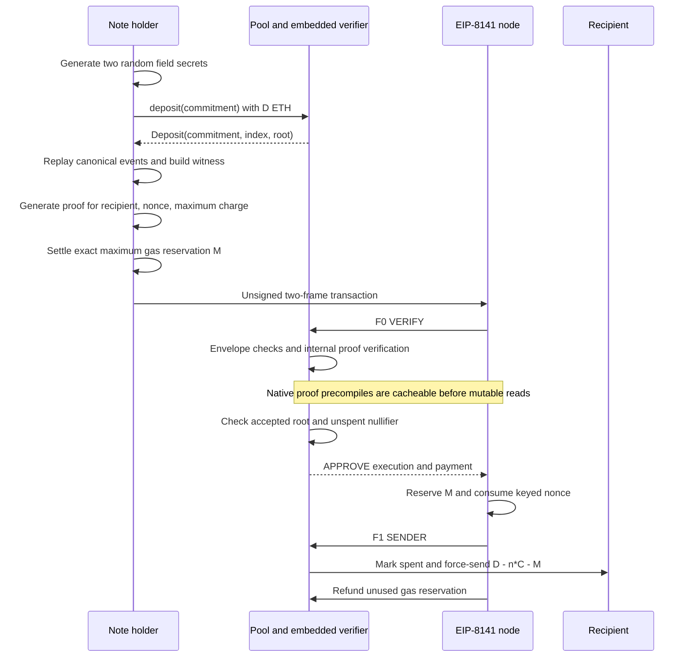

# Simple ETH privacy pool

A depth-20 Circom/Poseidon ETH pool with real Groth16 proofs on this repository's EIP-8141 fork. The pool is sender and payer. **This is an unaudited development implementation with single-party development keys, not a real-funds release.**

## Run

Build the repository toolchain and install dependencies first (`make build`; see root README). Requires Node.js 24.5+, Foundry and the custom `build/bin/solc`.

```sh
make privacy-test   # local setup/cache, actual proof tests, privacy Forge tests
make test           # local setup/cache, proof tests, entire Forge suite
make e2e-privacy    # fresh devnet, public validation budgets, real frame transactions
RPC_URL=http://127.0.0.1:18546 make e2e-privacy  # alternate local port
```

The privacy E2E script defaults to `MAX_VERIFY_GAS=250000`, `MAX_REVALIDATION_GAS=100000`, state-dependent execution cap 250000 and validation state cap 500000. Explicit environment overrides are recorded in the E2E report. The shared devnet's larger benchmark defaults are not used by this script. It refuses an occupied RPC endpoint and cleans up its own node. `npm run privacy:e2e --prefix contracts` uses an already running devnet and prepared artifacts instead.

Build output lives in gitignored `contracts/privacy-pool/build/`. Setup hashes the circuit, lockfile, setup script, compiler, pool source dependencies and generated artifacts. Changed inputs regenerate the local release; matching artifacts are reused. The SDK rejects mismatches. Hash checks detect accidental drift, not malicious manifest replacement. Never replace keys for a funded deployment.

`pool.json` is the deployable pool ABI/creation bytecode. Constructor: `(address hasher, uint256 denomination)`. `poseidon.json` contains the required two-input Poseidon implementation. `pool-harness.json` is exclusively for failure tests. `PrivacyPool8141.sol` is now an abstract policy/tree base, not a standalone deployable contract. Setup generates the concrete `Groth16PrivacyPool8141` by inheriting a checked internal adaptation of the exported verifier with its embedded key. `verifier.json` and `internal-verifier.json` are reference/test artifacts. Proof testing produces a public-only `fixture.json`; E2E produces `e2e-report.json` with gas/fees/receipts and no note secrets.

## Flow



Deposit denomination `D` is immutable and must exceed `C = 0.001 ETH`. Leaves append to a depth-20 Poseidon tree with capacity 1,048,576. The pool permanently accepts nonempty historical roots in its own storage. No recent-root references, expiry window, sponsor, token or swap are involved. A full tree requires a new pool. Callers reconstruct witnesses from canonical Deposit events; reorg handling and durable encrypted secret backup are wallet responsibilities.

Deposit, denomination, withdrawal recipient, nullifier and timing are public. Membership hides which commitment is being spent. A one-note historical root provides no useful anonymity. Reusing secrets can link or invalidate notes; losing either secret loses access. This developer SDK is not a complete wallet or privacy network layer.

## Circuit and context binding

Pinned compiler: Circom 2.2.3 via `circom2@0.2.23`. The circuit uses circomlib's original Poseidon over the BN254 scalar field `r`; `IPoseidon2` means two inputs, not the separate Poseidon2 hash construction.

```
commitment    = Poseidon([1, nullifierSecret, secret])
nullifierHash = Poseidon([2, nullifierSecret])
public inputs = [root, nullifierHash, context]
context       = uint256(statementHash) % r
```

Both secrets are independently rejection-sampled nonzero field elements. Membership constrains 20 siblings and a 20-bit leaf index. A private `contextSquare = context * context` constraint binds the public context, following the binding-only input pattern in [Tornado's circuit](https://github.com/tornadocash/tornado-core/blob/master/circuits/withdraw.circom). Tests inspect the actual O2 R1CS to ensure the nonlinear context constraint survives, and verify that changing any public input invalidates the proof.

The full statement hash remains `keccak256(abi.encode(typehash, ...values))` with this exact type string:

```
WithdrawalStatementV2(uint256 chainId,address pool,uint256 denomination,bytes32 root,bytes32 nullifierHash,address recipient,uint64 nonceSeq,uint256 maxGasCharge)
```

Unlike the previous five-signal circuit, the 256-bit digest is now reduced to one scalar. This is not a lossless encoding: raw digests differing by a multiple of `r` alias. Security relies on collision/second-preimage resistance of the reduced hash over the structured statement. The contract computes the digest from the actual statement; callers cannot substitute an arbitrary scalar. Root and nullifier remain separate canonical field values and are rejected if `>= r`.

Proof encoding is standard Groth16 A/B/C: eight coordinates, **256 bytes**. No extra authorization output is supplied. The new circuit, verification key and proof format are incompatible with the old five-signal release. Commitment/note hashing and the statement type remain unchanged, but existing pool deployments do not acquire the new verifier.

## On-chain gas optimization

The design applies the three-input approach from [the validation-budget analysis, Appendix A.1](https://ethresear.ch/t/eip-8141-and-minimum-required-validation-budget-for-privacy-applications/25889). It avoids adding a large SHA-256 circuit or a new hybrid commitment scheme for this single-note pool. The existing custom statement preserves bounded fee adjustment without reproving; root storage and retry accounting remain intact.

| Circuit | Public signals | O1 constraints | O2 constraints | Proof bytes |
|---|---:|---:|---:|---:|
| Previous context limbs + authorization | 5 | 12,537 | 5,885 | 288 |
| Reduced context + nonlinear binding | 3 | 11,544 | 5,336 | 256 |

Public input reduction removes two EC multiplications and two EC additions from verification. Smaller constraints mainly improve proving work, not pairing gas. The one-multiplication Merkle swap and O2 compilation remain.

**The verifier runs internally in the pool.** An immutable external verifier address would incur a mutable code identity dependency before pairing. We first avoided that with an embedded verifier and self-STATICCALL; the current release also removes the self-call and its calldata copy/dispatch. Proof A/B/C are checked-length calldata views, and only the three public signals use a memory array. Only native precompiles are called externally before root/spent reads. The standalone `Groth16PrivacyPoolVerifier` adapter remains for tooling/reference tests and is not included in the pool's validation call path.

`internal-verifier.mjs` adapts the pinned snarkjs template with checked replacements. It preserves the key, curve operations, field bounds and pairing construction. The changes are:

- The verifier returns a Solidity bool instead of using EVM `return` to terminate its caller's frame.
- EC multiplication/addition failures propagate a false status via Yul `leave`; the enclosing pairing function also exits false. Invalid public fields skip pairing and return false.
- Public signal reads use memory, while A/B/C remain calldata reads.
- The free-memory pointer reserves the 896-byte verification region **plus 128 bytes of EC scratch**, since the caller continues allocating after verification.

The transform pins memory-layout constants and expected function/call shapes and rejects unexpected frame-terminating opcodes. Original, GAS-adapted and internal source artifacts remain available for review. Tests compare the internal verifier with the GAS-adapted upstream verifier using the same key: four valid proof vectors, all public-input field bounds, invalid/infinite curve points, insufficient gas and 256 fuzz mutations across the eight proof coordinates and three public inputs. Continuation tests verify valid and invalid returns, existing memory contents and allocations after the call. Template drift tests exercise transformation failures. These are differential tests, not a formal equivalence proof or an audit.

The three-input verifier makes seven native calls, but geth's **validation** memo admits only the three EC multiplications and the pairing. The three cheap EC additions are not eligible. Retained native credit is therefore `3*6000 + 181000 = 199000`, consuming four memo entries. The current declared budget of 232,300 yields `G-c = 33300`. The earlier 250,000 budget yielded 51,000, not 50,550; including EC additions in the credit was incorrect. Likewise, the previous five-input circuit used six eligible memo entries, so eight-entry memo capacity was not its limiting factor.

Setup preserves the upstream generated verifier and changes exactly three `sub(gas(), 2000)` gas arguments to `gas()`, required by the fork's GAS-followed-by-CALL tracer rule. It does not change curve arithmetic. EIP-150 still retains caller gas. Independent review must cover this generated-code adaptation and the new context binding.

| Frame | Declared execution budget | Declared state budget |
|---|---:|---:|
| VERIFY | 232,300 | 100,000 |
| SENDER | 200,000 | 800,000 |

Measured on fresh local devnets with real proofs:

| Validation case | Previous | Optimized |
|---|---:|---:|
| First withdrawal VERIFY execution | 257,437 | 229,861 |
| Included failed delivery VERIFY execution | 257,459 | 229,883 |
| Retry VERIFY execution | 237,459 | 209,883 |
| Declared VERIFY budget | 450,000 | 232,300 |

The first withdrawal saves 27,576 execution gas (~10.7%) from the five-input baseline. Direct execution-word comparisons, nonce-key reuse and proof adapter simplification first reduced VERIFY to 234,540; solc `optimizer_runs=10000` then reduced it to 234,131. Removing the self-call saves another **898 gas**, to **233,233**. The failure harness has 22 additional VERIFY gas because of its different compiled dispatch layout. Runtime code shrank from 7,966 to **7,772 bytes** in the internal-call change; both generated pool runtimes are checked against the 24,576-byte limit.

Fixed-length statement hashing, scratch-memory nonce hashing and removal of the repeated current-frame-index lookup save another **442 gas**, bringing the first withdrawal to **232,791** and runtime code to **7,657 bytes**. Hash equivalence against `abi.encode` is covered by 256 fuzz cases. The declaration drops by 400 gas while retaining at least 3,287 gas of measured headroom.

Combining per-field XOR mismatches with bitwise OR replaces repeated short-circuit branches in the envelope, execution data, fee and nonce checks. Frame count/index, payload length and nonce count are still guarded before dependent reads. This saves another **445 execution gas**, reaching **232,346** (harness **232,368**, retry **212,368**) with **7,637 runtime bytes**. Each group still rejects if any field differs; the E2E includes individual mutations and simultaneous equal-bit mutations that must not cancel. Invalid requests may evaluate more read-only fields before reverting; the accepted envelope is unchanged.

The generated pool and internal-verifier harness now use `--via-ir`, still with 10,000 optimizer runs. The explicit Yul optimizer sequence matches the existing `foundry.toml` workaround: omit UnusedStoreEliminator (`S`) for the pinned development compiler's assertion bug. Artifact metadata records the IR mode and sequence, and the manifest pins the setup script/compiler hashes. This changes code generation, not Solidity checks or curve operations. The first VERIFY saves **2,485 gas** to **229,861**, with runtime **6,711 bytes**. Differential verifier/memory-continuation tests and the full geth E2E cover this compilation path. The declaration is lowered by 3,400, so measured headroom decreases from 3,354 to **2,439** gas (harness **2,417**); this is explicitly a combination of execution savings and reduced margin.

Current budget breakdown:

| Component | Gas |
|---|---:|
| Cache-eligible native work: three EC mul + pairing | 199,000 |
| First-use nonce surcharge | 20,000 |
| Other measured VERIFY work, including 450 for EC additions | 10,861 |
| Measured first-use VERIFY total | 229,861 |
| Declared headroom (production pool; harness has 2,417) | 2,439 |
| Declared budget | 232,300 |
| Revalidation admission budget G-c | 33,300 |

A fresh devnet E2E passed normal withdrawal, included delivery failure and retry with **MAX_REVALIDATION_GAS=33300** and declared VERIFY gas 232300, including 26 malformed/unauthorized transaction rejections.

The former 250k -> 242k squeeze reduced only declared exposure (51k -> 43k), not actual execution. Code and compiler optimizations reduce real execution before lowering the declaration to 232.3k. The nonce surcharge remains protocol work; EC additions are not removed or cached. Fee amounts and proving times vary with base fees and the local machine, so neither is used as a normalized gas comparison. This is a whole-path measurement including compiler/code-layout effects, not an isolated EC microbenchmark. Changes to the verifier, validation logic or fork require rebenchmarking; the headroom is not a future gas-schedule guarantee.

`MAX_VERIFY_GAS` bounds declared validation gas, not measured consumption. `MAX_REVALIDATION_GAS` bounds declared gas minus retained pre-mutable native gas. The 100k limit is not a cap on the full pairing verification. E2E reports both configured caps, declared gas and measured VERIFY gas.

## Frame authorization and accounting

Validation pins two frames, modes, flags, targets, zero values, singleton domain-separated nullifier nonce key and sequence, execution calldata and state/execution budgets. Signatures, recent roots and blob fields must be empty. Real transaction fee fields must match the intent; `FrameTxLib.maxCost()` must equal its reservation. The SDK searches a bounded calldata-cost fixed point after proof serialization and rejects charges above authorization.

Fee fields and reservation are outside the proof hash to avoid the proof/calldata cost cycle. Anyone seeing a valid proof may submit it or adjust fees within its maximum deduction, but cannot change the recipient, nonce, deployment, root or cap. Fee conditions may make the fixed cap insufficient; withdrawal must then wait.

For `n` prior included failures, current reservation `M`, actual fee `A` and cap `C`:

```
recipient payout = D - n*C - M
pool surplus after success = sum(C - A_i for prior failures) + (M - A)
```

Each attempt requires `0 < M <= authorized maximum <= C` and `n*C + M < D`. Prior failures conservatively forfeit the whole cap, not their actual fee. Refunds remain with the payer pool; there is no sweep or refund claim. This does not implement exact unused-gas refunds to the recipient. Exhausting the retry budget can lock residual note value.

On execution failure, spent state and payout revert, but gas is paid and the keyed nonce advances. A new proof for the next sequence permits recovery. The spent mapping remains necessary because permitting sequence increments for recovery must not permit withdrawal again after success. Under tested nonce/reservation semantics, failed attempts cannot consume other notes' backing.

ETH delivery uses a helper created and self-destructed in the same transaction to avoid recipient callbacks. `DevelopmentPrivacyPoolDeliveryHarness` deliberately fails once to verify included-failure accounting and retry against real receipts; it is never a user pool.

## Release limits

Tests cover real proof validity and public-input binding, retained O2 constraints, wrong witnesses, canonical inputs, cross-language Merkle roots, envelope mutations, forced delivery, accounting fuzzing, real payment and included-failure recovery. These checks are not an audit. Production requires independent circuit/contract/protocol review, a verifiable multi-party setup with immutable published artifacts, reorg/concurrency/load testing, wallet/indexer/backup work and an operational gas policy.

Research snapshots, baseline receipts and optimization notes are in `.context/privacy-pool-gas-optimization/`; original nero research is in `.context/privacy-pool-research/`. Those historical documents describe earlier designs. Generated development setup artifacts and keys must not be presented as production ceremony artifacts.
